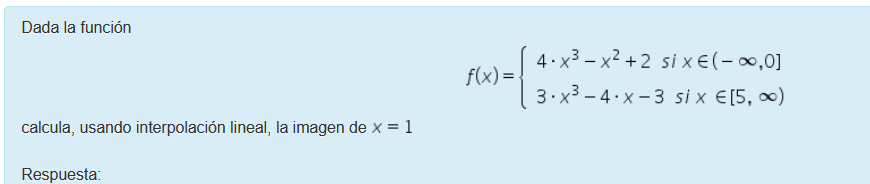

```{r}
library(knitr)    # For knitting document and include_graphics function
library(ggplot2)  # For plotting
library('png') 
```
## pregunta 1

```{r}
img1_path <- "preg1.png"
include_graphics(img1_path)
```
Primero calculamos el valor real con la ecuacion y el valor de X

```{r}
fun1 <- function(x){
  9*sin(4*x)+4*cos(x)
}
fun1(6)
```

```{r}

x=c(0,1,2,5,8)
y=c(4,-4.65,7.24,9.351,4.381)

```
```{r}
polinomio_L<-function(x,X){
  
# Recibe los parámetros:
#   x : punto a evaluar
#   L : valores de X en un vector


  L=c(0)
  # iniciamos el polinomio para poder utilizarlo en la iteración
  for(i in 1:length(X)){
    L[i]=1
    for(j in 1:length(X)){
      # debemos tener en cuenta la condición de la formula de Lagrange
      # i debe ser diferente de j
      if (i!=j){
        # realizamos el productorio, con cada iteración se añade un factor
        L[i]=L[i]*((x-X[j])/(X[i]-X[j]))
      }
    }
  }
  return(L) # retorna coeficientes
}

p_interpolación<- function(y,L){
# Recibe los parámetros:
#   y : vector con las abscisas
#   L : un polinomio de lagrange para un valor de x en coeficietnes

  p=0
  for(i in 1:length(y)){
    p=p+(y[i]*L[i])
  }
  return(p)
}
L <- polinomio_L(6,x)
r <- p_interpolación(y,L)
r
```
finalmente restamos los resultados para obtener la respuesta
```{r}
fun1(6)-r
```

## pregunta 2

```{r}
img1_path <- "preg2.png"
include_graphics(img1_path)
```
```{r}
# primero definir la funcion
f2 <- function(x){
  return(1/(1+x))
}
# luego formula del trapecio compuesta para funcion f
trap=function(f,a,b,m)
{
  x=seq(a,b,length.out=m+1)
  y=f(x)
  p.area=sum((y[2:(m+1)]+y[1:m]))
  p.area=p.area*abs(b-a)/(2*m)
  return(p.area)
}
# para generar el primer nivel 0 ver el numero de valores en nivel 0:

n0 <- function(valores,f,a,b){
  
  n=c()
  for(i in 2^(0:(valores-1))){
    n=c(n,trap(f2,0,1,i))
  }
  return(n)
}
v0 <- n0(5,f2,0,1)
k=length(v0)
nk <- function(ncero){
  
  mat <- matrix(0, length(ncero), k)
  mat[,1] <- ncero
  # ((4*n1[i+1]-n1[i])/(4-1))
  # for(i in 2:k){
  #   a=i
  #   b=i+1
  #   mat[,k] <- 4**(k-1)*mat[k,k-1]
  # }
  return (mat)
}
mat <- nk(v0)

for(i in 1:k){
  vect=c()
  for(j in 1:(k-i)){
    if(j>0){
      a=mat[j+1,i]
      b=mat[j,i]
      pot= 4**i
      vect <- c(vect ,(pot*a-b)/(pot-1))
    }
  }
  if(i<k){
     mat[,i+1] <- vect[1:k]
  }
}

mat


```

## pregunta 3

```{r}
img1_path <- "p3_2022-06-01_165803.png"
include_graphics(img1_path)
```

```{r}

polyinterp=function(x,y)
{
  # comprobamos que la longitud de los vectores sea la misma
  if(length(x)!=length(y))
    stop ("La longitud de los vectores x e y debe ser la misma" )
  # calculamos el valor de n que es el grado del polinomio
  # a partir del numero de puntos menos 1
  n=length(x)-1
  # creamos la primera columna de la matriz de vandermonde
  vandermonde=rep(1,length(x))
  # iteramos para ir agregando las columnas siguientes según
  # el grado del polinomio
  for(i in 1:n)
  {
    # la matriz contiene columnas sucesivas de los valores de x
    # elevados a la nth potencia
    xi=x^i
    vandermonde=cbind(vandermonde,xi)
  }
  # resolvemos el sistema de ecuaciones
  beta=solve(vandermonde,y, tol=1e-22)
  # borramos los nombres de las columnas (xi)
  names(beta)=NULL
  # nos retorna los coeficientes del polinomio
  return(beta)
}

horner=function(x,coefs){

  y=rep(0,length(x))
  for(i in length(coefs):1)
    y=coefs[i]+x*y
  
  return(y)
}

trap=function(f,a,b,m)
{
  x=seq(a,b,length.out=m+1)
  
  y=horner(x,f)
  p.area=sum((y[2:(m+1)]+y[1:m]))
  p.area=p.area*abs(b-a)/(2*m)
  return(p.area)
}

x=c(0,7/36,7/18,1/2,25/36,8/9,35/36)
y=c(3/5,108/173,54/83,2/3,108/155,27/37,108/145)
f <- polyinterp(x,y)
trap(f,0,35/36,100)


```


## pregunta 4

Dada la función

```{r figurename, echo=FALSE, fig.cap="my caption", out.width = '90%'}

```

aqui tenemos que encontrar una linea en los intervalos que no nombra la funcion, es decir entre 0-5, por lo que podemos usarlos puntos x=0 reemplazando en la funcion superior y = 2 por lo que tenemos el primer punto (0,2), lo mismo en la funcion inferior para  x= 5 , y= 352 , por lo que tenemos el segundo punto (5,352), a partir de alli solo tenemos que crear una linea que pase por los dos puntos
